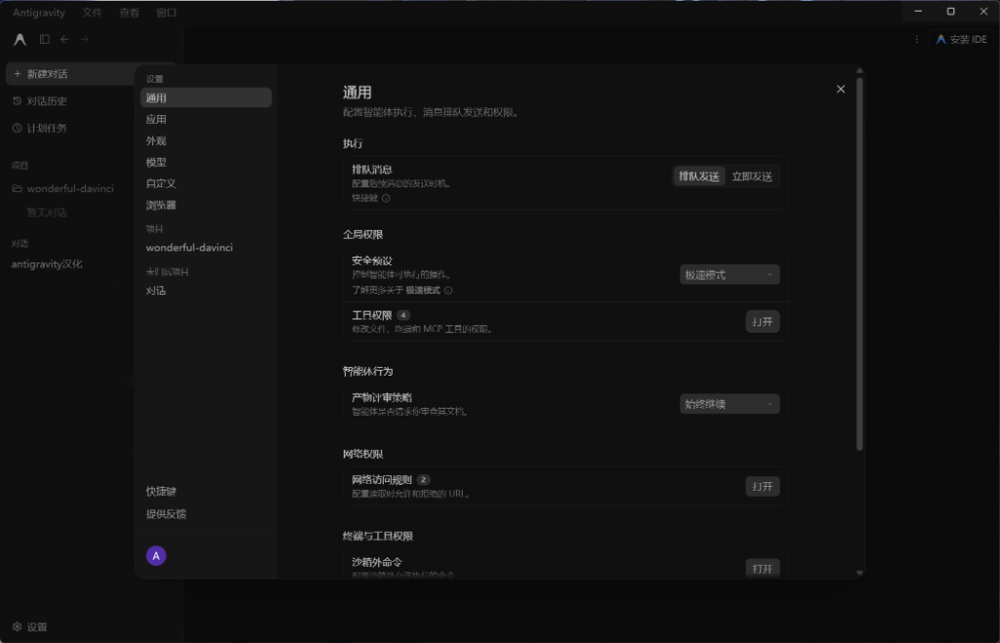
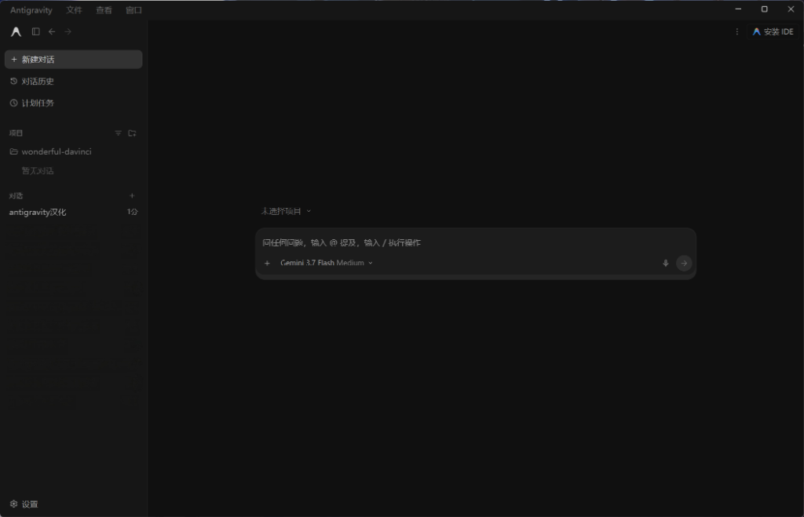

# Antigravity Desktop 中文汉化补丁

面向 Windows 版 Google Antigravity Desktop 的中文本地化补丁工具。

当前汉化词库包含 **1355 条精确中英词汇映射 + 160 条动态正则匹配规则**，覆盖设置菜单、权限预设、快捷键面板、交互弹窗与基础流程。

---

## 📸 效果预览

### 1. Antigravity 设置页面汉化效果

### 2. Antigravity 主界面汉化效果

---

## 💡 工作原理与兼容性说明

1. **实现机制**：
   - 本工具通过对客户端 `app.asar` 中的自定义协议（`customScheme`）进行安全重定向，加载汉化后的 UI 脚本，**并非 Antigravity 官方内置的多语言切换功能**。
   - 安装汉化或恢复英文均通过替换/还原核心文件实现，**操作完成后需要重启 Antigravity 客户端生效**。
2. **安全与备份**：
   - 工具在修改前会自动校验安装路径、客户端版本与 `app.asar` 的 SHA-256 文件指纹。
   - 首次安装时会自动备份官方原始文件；运行恢复脚本时将使用备份文件进行无损还原。
3. **兼容版本**：
   - 采用严格的白名单指纹匹配机制，目前已内置收录从 2.2.1 到 2.15.0 的 16 个已验证目标构建。
   - 若检测到未知版本或文件指纹不匹配，工具将主动安全拦截并拒绝注入，避免损坏客户端。

---

## 🚀 快速使用指南

### 推荐方式：下载 Release 便携包（普通用户推荐）
便携发布包已内置官方 Node.js 运行环境与锁定依赖，**用户无需在系统中安装 Node.js**。

1. 进入项目的 [Releases 发布页面](../../releases/latest)，下载最新的 `antigravity-desktop-zhcn-portable-win-x64.zip`；
2. 将压缩包完整解压到本地任意文件夹；
3. （推荐）双击运行 **`一键检查兼容性.bat`**，确认当前安装的 Antigravity 是否处于受支持列表中；
4. 双击运行 **`一键汉化.bat`**，根据提示完成安装；
5. 启动（或重启）Antigravity Desktop 即可查看中文界面。

### 恢复官方纯净英文
1. 双击运行解压目录中的 **`一键恢复英文.bat`**；
2. 脚本将自动清理注入补丁并还原官方原版备份；
3. 重启 Antigravity Desktop 即可恢复官方英文状态。

### 高级方式：通过 GitHub 源码运行（开发者适用）
如果您直接通过 `Code -> Download ZIP` 或 `git clone` 获取源码：
- **环境要求**：本地需已安装 **Node.js >= 22.12.0** 与 **npm**。
- 运行 `一键汉化.bat` 时，引导脚本会自动通过 `npm ci` 安装锁定的 `@electron/asar@4.2.1` 打包依赖。

---

## 🔄 Antigravity 客户端更新后怎么办？

当 Google Antigravity Desktop 自动推送更新至新版本或新构建后：
1. 原版客户端可能会覆盖汉化补丁并恢复为英文界面；
2. 请先运行 **`一键检查兼容性.bat`** 检查新版本是否已支持；
3. 若提示指纹不匹配，请勿强行修改，建议等待本项目发布兼容新版本的 Release 更新，或参考维护手册提交新版本兼容指纹。

---

## 🛠️ 维护者与开发者指南

如需参与词库扩展、指纹采集、便携包构建或签名校验，请参考开发者文档：
- [系统架构设计 (Architecture)](docs/architecture.md)
- [版本维护与适配指南 (Maintenance)](docs/maintenance.md)
- [Release 构建与发布流程 (Releasing)](docs/releasing.md)

---

## 📜 项目来源与贡献

本项目是在社区开源项目 [chenmo00000/antigravity-desktop-zhcn](https://github.com/chenmo00000/antigravity-desktop-zhcn) 基础上继续迭代、修复和扩展，遵循 [MIT License](LICENSE) 协议开源。在此由衷感谢原项目与所有早期贡献者的基础工作。

当前项目致力于长期跟随 Google Antigravity Desktop 新版本持续维护，完善中文本地化词库、版本兼容性与未翻译英文 UI 自动发现机制。

欢迎社区开发者与用户共同参与维护！如果您在日常使用中发现任何漏翻、排版问题或新版客户端适配需求，欢迎通过 [GitHub Issues](../../issues) 提交反馈，或直接发起 [Pull Requests](../../pulls) 贡献翻译词条与优化改进。
