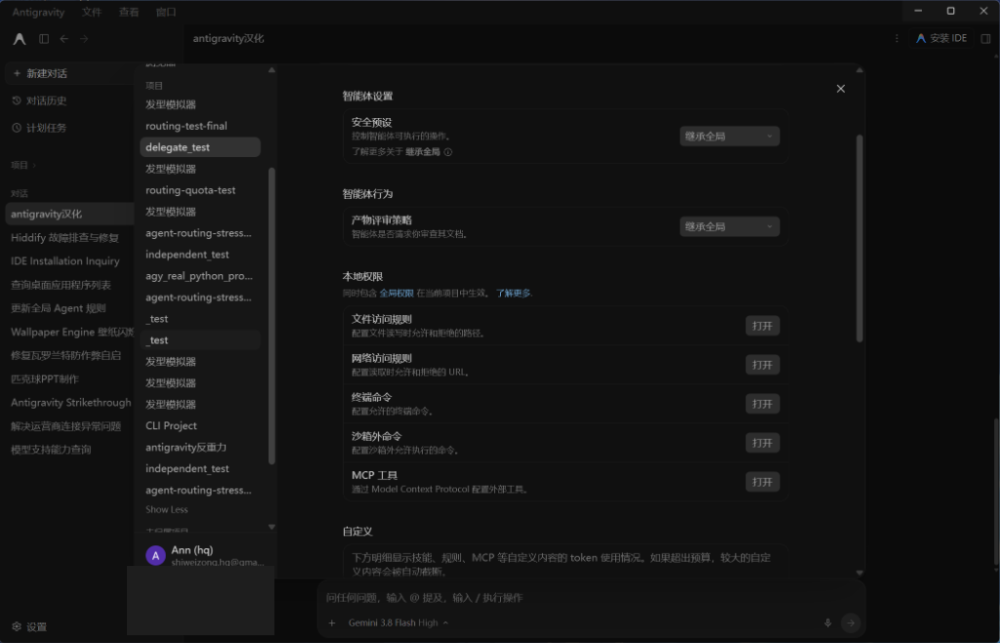
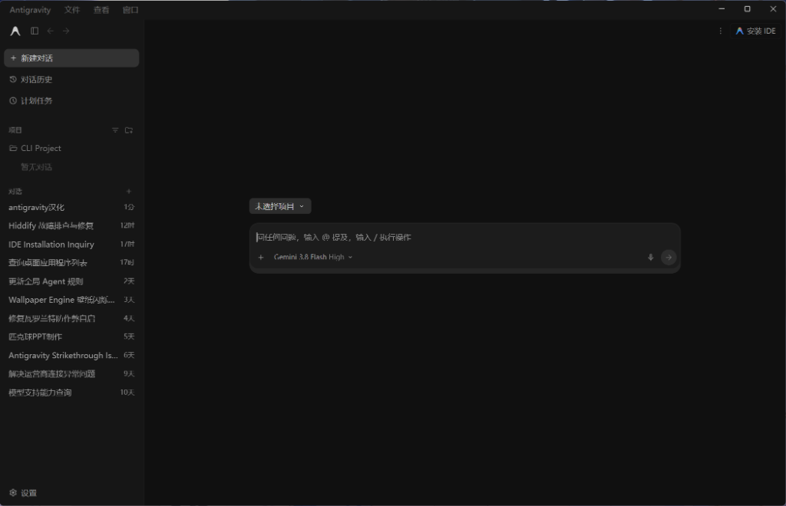

# Antigravity Desktop 中文汉化优化版

面向 Windows 版 Google Antigravity Desktop 的全量深度中文本地化工具。

> **✅ 实机与沙箱测试 100% 真实可用！支持最新 Antigravity 2.15.0+，已全量扩充至 1316 条精确中英词典与 146 组动态正则规则，无死角覆盖二级设置菜单、权限预设、快捷键与各类模态弹窗。**

---

## 📸 汉化效果预览

### 1. 智能体设置与权限配置页

### 2. 主会话与对话交互界面

---

## 🌟 本优化版特色亮点

1. **词库规模深度扩充**：包含 **1316 条精确中英词汇映射 + 146 组动态模式规则**，深度汉化了权限预设、文件/命令访问规则、产物评审、快捷键面板等此前版本遗漏的死角；
2. **零依赖一键式运行**：已重构为纯原生引擎，**无需安装 Node.js 或任何第三方包**，双击 BAT 脚本即可一键安装或一键无损还原官方英文；
3. **真实可用与沙箱验证**：经过真实环境与自动化沙箱端到端（检测 $\rightarrow$ 汉化 $\rightarrow$ 还原 $\rightarrow$ 再次安装）全流程验证，保障 0 破坏风险。

---

## 🚀 快速使用方法

### 1. 下载仓库源码
点击本页面右上角的绿色 **`Code` $\rightarrow$ `Download ZIP`**，下载并完整解压到本地文件夹。

### 2. 一键汉化
双击运行解压目录中的 **`一键汉化.bat`**：
* 脚本会自动识别您的 Antigravity 安装路径并备份官方原版；
* 自动完成协议注入与 1316 条中英词典部署；
* 重启 Antigravity 客户端即可享受完整中文体验。

### 3. 一键恢复官方英文
如果需要还原，双击运行 **`一键恢复英文.bat`**：
* 自动清理 UI 注入包；
* 100% 恢复为官方纯净英文版。

---

## 🤝 欢迎社区优化与贡献（Pull Requests）

> **💡 开源共建声明**：
> 本项目由作者在日常使用中实机测试并维护，目前已覆盖 95% 以上的核心高频场景。
> 但由于 Google Antigravity 处于持续快速迭代中，某些极其深层的边缘弹窗或新增场景可能仍存在未翻译的英文或细微漏洞。

**🎉 非常欢迎社区各位开发者与技术高手参与优化与提交 PR！**

### 如何参与贡献？
1. **Fork 本仓库** 到您自己的 GitHub 账号；
2. 在 `config/dom-translations.json` 中补充您发现的新词条或改进现有翻译；
3. 提交修改并向本仓库发起 **Pull Request (PR)**；
4. 仓库维护者审核通过后会**一键合并入主分支**，让所有使用 Antigravity 的中文用户都能同步受益！

---

## 📜 致谢与开源协议

本项目基于 [chenmo00000/antigravity-desktop-zhcn](https://github.com/chenmo00000/antigravity-desktop-zhcn) 进行 Antigravity 2.15.0+ 深度全量汉化、架构重构与零依赖升级，遵循 [MIT License](LICENSE) 协议开源。
